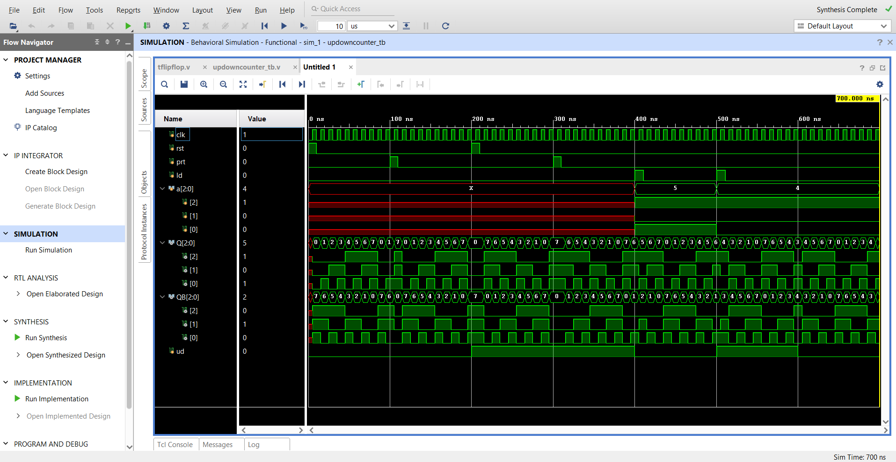

# 3-Bit-Synchronous-Up-Down-Counter-using-T-Flip-Flops-Verilog-HDL-
A 3-bit synchronous Up/Down counter built structurally in Verilog using custom T Flip-Flops, with synchronous reset, preset, and parallel load. Simulated in Icarus Verilog &amp; GTKWave, cross-verified in Xilinx Vivado. Includes testbench, VCD dump, I/O waveform, and RTL schematic.

# 🔁 3-Bit Synchronous Up/Down Counter using T Flip-Flops (Verilog HDL)


A fully synchronous **3-bit Up/Down Counter** designed at the gate/structural level using **T Flip-Flops (Toggle Flip-Flops)**. The counter supports **synchronous reset**, **synchronous preset**, and **parallel (synchronous) load**, and can count **up** or **down** based on a mode-control signal `ud`. The design is verified using a self-checking testbench simulated in **Icarus Verilog**, with waveform inspection in **GTKWave**, developed in **VS Code**, and cross-verified/synthesizable in **Xilinx Vivado**.

---

## 📖 Table of Contents

1. [Project Overview](#-project-overview)
2. [Features](#-features)
3. [Repository / File Structure](#-repository--file-structure)
4. [Tools & Software Requirements](#-tools--software-requirements)
5. [Theory of Operation](#-theory-of-operation)
   - [What is a T Flip-Flop?](#what-is-a-t-flip-flop)
   - [Up/Down Counter Design Logic](#updown-counter-design-logic)
   - [Toggle Equation Derivation](#toggle-equation-derivation)
6. [Module-by-Module Description](#-module-by-module-description)
   - [Module 1: `tflipflop` (T_flipflop.v)](#module-1-tflipflop-t_flipflopv)
   - [Module 2: `updowncounter` (updowncounter.v)](#module-2-updowncounter-updowncounterv)
   - [Module 3: `updowncounter_tb` (updowncounter.v)](#module-3-updowncounter_tb-updowncounterv)
7. [Pin / Port Description](#-pin--port-description)
   - [T Flip-Flop Pin Description](#t-flip-flop-pin-description)
   - [Top-Level `updowncounter` Pin Description](#top-level-updowncounter-pin-description)
   - [Testbench Pin Description](#testbench-pin-description)
8. [Internal Signal Connectivity (Structural Wiring)](#-internal-signal-connectivity-structural-wiring)
9. [State / Mode Table](#-state--mode-table)
10. [Testbench Stimulus Timeline](#-testbench-stimulus-timeline)
11. [How This Project Was Made](#-how-this-project-was-made)
12. [How to Run the Simulation (Windows / Ubuntu / macOS + Icarus Verilog + VS Code)](#-how-to-run-the-simulation-windows--ubuntu--macos--icarus-verilog--vs-code)
13. [Viewing Waveforms in GTKWave](#-viewing-waveforms-in-gtkwave)
14. [Simulating / Synthesizing in Xilinx Vivado](#-simulating--synthesizing-in-xilinx-vivado)
15. [Expected Output / Console Log Format](#-expected-output--console-log-format)
16. [Schematic](#-schematic)
17. [I/O Waveform](#-io-waveform)
18. [VCD Dump File](#-vcd-dump-file)
19. [Applications](#-applications)
20. [Limitations](#-limitations)
21. [Future Improvements](#-future-improvements)
22. [Troubleshooting / FAQ](#-troubleshooting--faq)
23. [License](#-license)
24. [Author](#-author)

---

## 📌 Project Overview

This project implements a **3-bit synchronous Up/Down counter** using three instances of a custom **T Flip-Flop** module. Unlike behavioral counters that use a simple `always @(posedge clk) count <= count + 1`, this design is built at the **structural/gate level**, meaning each flip-flop is individually instantiated and the toggle (`T`) input of each flip-flop is computed using **combinational Boolean logic** derived from the current state of the lower-order flip-flops.

The direction of counting (increment or decrement) is controlled by a single control bit `ud`:
- `ud = 0` → **Up-counting mode** (0 → 1 → 2 → ... → 7 → 0 ...)
- `ud = 1` → **Down-counting mode** (7 → 6 → 5 → ... → 0 → 7 ...)

The counter also supports:
- **Synchronous Reset (`rst`)** – forces the counter to `000`
- **Synchronous Preset (`prt`)** – forces the counter to `111`
- **Synchronous Parallel Load (`ld`)** – loads an external 3-bit value `a[2:0]` into the counter

This makes the design a **universal up/down counter with reset, preset, and load capability**, commonly used in digital system design courses to demonstrate flip-flop excitation tables, sequential circuit design, and structural Verilog modeling.

---

## ✨ Features

- ✅ 3-bit synchronous Up/Down counter
- ✅ Built using structural instantiation of custom T Flip-Flops (no behavioral `+1` shortcut)
- ✅ **Clean separation** between the synthesizable design (`updowncounter` module) and the testbench (`updowncounter_tb`) — the testbench simply instantiates the design as a single unit (`u1`)
- ✅ Synchronous active-high **Reset**
- ✅ Synchronous active-high **Preset** (sets counter to all 1s)
- ✅ Synchronous active-high **Parallel Load** of a 3-bit value
- ✅ Direction control using a single `ud` (up/down) signal
- ✅ Dual outputs available: `Q` (true) and `QB` (complement) for every bit
- ✅ Self-contained testbench with clock generation, stimulus sequencing, and `$monitor` console logging
- ✅ VCD dump generation for waveform analysis in GTKWave
- ✅ Fully synthesizable RTL (the `updowncounter` module contains zero simulation-only constructs), verified in Xilinx Vivado
- ✅ Clean modular code — easy to extend to 4-bit, 8-bit, or n-bit counters
- ✅ Priority-encoded control logic: `rst` > `prt` > `ld` > `toggle`

---

## 🗂 Repository / File Structure

```
UpDown-Counter-TFlipFlop/
│
├── T_flipflop.v          # T Flip-Flop module (core building block, reusable component)
├── updowncounter.v       # Synthesizable top-level `updowncounter` module + `updowncounter_tb` testbench
│
├── dump.vcd              # Value Change Dump file generated after simulation (for GTKWave)
├── io_wave.png           # Screenshot of the simulated input/output waveform (GTKWave capture)
├── scamatic.pdf          # Schematic diagram of the counter (RTL schematic, exported as PDF from Vivado)
│
└── README.md             # This file — full project documentation
```

> **Note:** `updowncounter.v` now contains **two** modules: the synthesizable structural top level `updowncounter` (instantiating the three `tflipflop`s with internal wires `w`/`wB` and driving the external `Q`/`QB` outputs via `assign`), and the testbench `updowncounter_tb`, which instantiates `updowncounter` as a single unit (`u1`) and drives it with stimulus. This is a clean DUT-vs-testbench separation — the design itself contains no simulation-only constructs and is directly synthesizable in Vivado without modification.

---

## 🛠 Tools & Software Requirements

| Tool | Purpose | Supported Platforms |
|---|---|---|
| **Icarus Verilog (`iverilog` / `vvp`)** | Compiling and simulating the Verilog RTL and testbench | Windows, Ubuntu/Linux, macOS |
| **VS Code** | Writing, editing, and organizing the Verilog source files (with Verilog/HDL extensions) | Windows, Ubuntu/Linux, macOS |
| **GTKWave** | Viewing the `dump.vcd` waveform file generated by the simulation | Windows, Ubuntu/Linux, macOS |
| **Xilinx Vivado** | RTL synthesis, schematic generation, and behavioral simulation cross-check | Windows, Ubuntu/Linux (officially supported) — **not natively available on macOS**, see note below |

> 🍎 **macOS note:** Xilinx does not ship a native macOS build of Vivado. On macOS, run Vivado inside a **Linux virtual machine** (VMware Fusion / Parallels / VirtualBox running Ubuntu) or a **Docker container**. Icarus Verilog, GTKWave, and VS Code all work natively on macOS with no workaround needed.

**Recommended VS Code Extensions:**
- `Verilog-HDL/SystemVerilog` (by mshr-h) — syntax highlighting & linting
- `TerosHDL` — schematic preview, linting, and simulation integration
- Any generic terminal-integrated extension to run `iverilog`/`vvp` commands directly from VS Code's integrated terminal

---

## 📚 Theory of Operation

### What is a T Flip-Flop?

A **T (Toggle) Flip-Flop** is a 1-bit sequential storage element with a single control input `T`:
- If `T = 1` at the clock edge → output **toggles** (Q → ~Q)
- If `T = 0` at the clock edge → output **holds** its previous value

In this project, the T flip-flop is **extended** with three additional synchronous controls that take priority over the toggle behavior:

| Priority | Signal | Behavior |
|---|---|---|
| 1 (Highest) | `rst` | Q ← 0, QB ← 1 |
| 2 | `prt` | Q ← 1, QB ← 0 |
| 3 | `ld` | Q ← a, QB ← ~a |
| 4 (Lowest) | `t` | Q ← Q if t=0, Q ← ~Q if t=1 |

### Up/Down Counter Design Logic

A classical way to build an n-bit up/down counter from T flip-flops is to compute each flip-flop's toggle input `T_i` based on the **AND of all lower-order bits** (for up-counting) or the **AND of the complements of all lower-order bits** (for down-counting):

- **Up-count rule:** Bit `i` toggles only when all bits below it (`0` to `i-1`) are `1` — exactly like ripple-carry binary addition.
- **Down-count rule:** Bit `i` toggles only when all bits below it (`0` to `i-1`) are `0` — exactly like binary borrow/decrement.

### Toggle Equation Derivation

For this 3-bit counter (internal bits `w0`, `w1`, `w2`, later assigned out to `Q`), the toggle inputs used inside the `updowncounter` module are:

```
T0 = 1                                            (LSB always toggles every clock)
T1 = (ud & w0) | (~ud & w0)  =  ud ^ w0            (toggles w1 when w0=1 in up-mode, or w0=0 in down-mode)
T2 = (~ud & w0 & w1) | (ud & wB0 & wB1)            (toggles w2 when w0=w1=1 in up-mode, or w0=w1=0 in down-mode)
```

**Verification:**
- When `ud = 0` (Up): `T1 = w0`, `T2 = w0 & w1` → standard ripple/synchronous up-counter carry logic ✔
- When `ud = 1` (Down): `T1 = ~w0`, `T2 = wB0 & wB1 = ~w0 & ~w1` → standard down-counter borrow logic ✔

This is exactly what is coded inside the `updowncounter` module:

```verilog
module updowncounter(clk,rst,prt,ld,ud,a,Q,QB);
input clk,rst,prt,ld,ud;
input [2:0] a;
output [2:0] Q,QB;
wire [2:0] w,wB;

tflipflop t0(clk,rst,prt,ld,a[0], 1'b1,                                    w[0],wB[0]);
tflipflop t1(clk,rst,prt,ld,a[1], ud ^ w[0],                               w[1],wB[1]);
tflipflop t2(clk,rst,prt,ld,a[2], (~ud & w[0] & w[1]) | (ud & wB[0] & wB[1]), w[2],wB[2]);

assign Q  = w;
assign QB = wB;
endmodule
```

> Note the internal signals are named `w`/`wB` (not `Q`/`QB`) inside `updowncounter` — the module's own `Q`/`QB` **outputs** are driven only at the very end via two `assign` statements. This keeps the internal wiring clearly separated from the module's external interface.

---

## 🧩 Module-by-Module Description

### Module 1: `tflipflop` (T_flipflop.v)

```verilog
module tflipflop(clk,rst,prt,ld,a,t,Q,QB);
input clk,rst,prt,t,ld,a;
output reg Q,QB;
```

**Description:**
This is the reusable, parametrized-by-instantiation core building block of the entire design — a single-bit flip-flop with four synchronous control mechanisms, all evaluated on the **positive edge of `clk`**, in strict priority order:

1. **`rst` (Reset)** — highest priority. When high, forces `Q = 0` and `QB = 1`, regardless of any other input.
2. **`prt` (Preset)** — second priority. When high (and `rst` is low), forces `Q = 1` and `QB = 0`.
3. **`ld` (Load)** — third priority. When high (and `rst`, `prt` are low), loads the external data bit `a` into `Q` (and its complement into `QB`).
4. **`t` (Toggle)** — lowest priority. If none of the above are asserted: when `t = 1`, the flip-flop toggles (`Q <= ~Q`); when `t = 0`, it holds its current value.

This priority-encoded `if–else if–else` structure ensures **no conflicting simultaneous assignments** and mirrors real hardware behavior of a JK/T flip-flop with reset/preset/load override pins, similar to a 74LS112-style flip-flop with additional load capability.

### Module 2: `updowncounter` (updowncounter.v)

```verilog
module updowncounter(clk,rst,prt,ld,ud,a,Q,QB);
input clk,rst,prt,ld,ud;
input [2:0] a;
output [2:0] Q,QB;
wire [2:0] w,wB;
```

**Description:**
This is the **synthesizable structural top-level design** — the actual up/down counter, free of any simulation-only constructs. It instantiates **three `tflipflop` modules** (`t0`, `t1`, `t2`) and wires their toggle (`t`) inputs using the combinational logic derived in the [Toggle Equation Derivation](#toggle-equation-derivation) section above:

- `t0` always toggles (`t = 1'b1`) — the LSB flips on every clock.
- `t1`'s toggle input is `ud ^ w[0]` — direction-dependent toggle based on the LSB.
- `t2`'s toggle input is `(~ud & w[0] & w[1]) | (ud & wB[0] & wB[1])` — direction-dependent toggle based on both lower bits.

The internal wires `w[2:0]` and `wB[2:0]` carry each flip-flop's raw `Q`/`QB` outputs, which are then routed to the module's actual outputs via two continuous assignments:

```verilog
assign Q  = w;
assign QB = wB;
```

Because this module contains **only** input/output ports, wires, and structural instantiations (no `initial` blocks, no `$monitor`, no `$dumpfile`), it can be handed directly to Vivado (or any synthesis tool) as the design's top module.

### Module 3: `updowncounter_tb` (updowncounter.v)

```verilog
module updowncounter_tb;
reg clk,rst,prt,ld;
reg [2:0] a;
wire [2:0] Q,QB;
reg ud;
updowncounter u1(clk,rst,prt,ld,ud,a,Q,QB);
```

**Description:**
This module is now a **pure testbench** — it no longer instantiates `tflipflop` directly. Instead, it instantiates a single instance of the top-level `updowncounter` module (`u1`) and treats it as a black box, connecting to it only through its external ports (`clk`, `rst`, `prt`, `ld`, `ud`, `a`, `Q`, `QB`). This is the standard, clean way to structure a Verilog testbench: **one line to instantiate the DUT**, followed by stimulus generation.

The testbench still handles all simulation-only responsibilities:
- Drives the clock (`always #5 clk = ~clk`, giving a 10ns period / 100MHz-equivalent simulation clock)
- Applies a sequence of stimulus vectors to exercise every operating mode (reset, preset, up-count, down-count, load)
- Dumps signal changes to `dump.vcd` for GTKWave via `$dumpfile`/`$dumpvars`
- Prints a live `$monitor` log of every signal transition to the simulation console

**Key internal signals:**

| Signal | Type | Width | Description |
|---|---|---|---|
| `clk` | reg | 1-bit | Simulation clock, toggled every 5ns (10ns period) |
| `rst` | reg | 1-bit | Synchronous reset control, fed into `u1` |
| `prt` | reg | 1-bit | Synchronous preset control, fed into `u1` |
| `ld` | reg | 1-bit | Synchronous parallel load enable, fed into `u1` |
| `a` | reg | 3-bit | Parallel load data bus, fed into `u1` |
| `ud` | reg | 1-bit | Up/Down mode select (`0` = up, `1` = down), fed into `u1` |
| `Q` | wire | 3-bit | Counter output from `u1` — `Q[0]` = LSB, `Q[2]` = MSB |
| `QB` | wire | 3-bit | Complement of counter output from `u1` |

---

## 🔌 Pin / Port Description

### T Flip-Flop Pin Description

| Pin Name | Direction | Width | Active Level | Description |
|---|---|---|---|---|
| `clk` | Input | 1-bit | Rising edge | System clock — all state updates occur on `posedge clk` |
| `rst` | Input | 1-bit | Active High | Synchronous reset — forces Q=0, QB=1 |
| `prt` | Input | 1-bit | Active High | Synchronous preset — forces Q=1, QB=0 |
| `ld` | Input | 1-bit | Active High | Synchronous load enable — loads `a` into Q |
| `a` | Input | 1-bit | — | Parallel load data input for this bit |
| `t` | Input | 1-bit | Active High | Toggle control — combinational function of counter state |
| `Q` | Output (reg) | 1-bit | — | True/normal flip-flop output |
| `QB` | Output (reg) | 1-bit | — | Complementary flip-flop output |

### Top-Level `updowncounter` Pin Description

| Pin Name | Direction | Width | Description |
|---|---|---|---|
| `clk` | Input | 1-bit | System clock |
| `rst` | Input | 1-bit | Synchronous reset, broadcast to all 3 internal flip-flops |
| `prt` | Input | 1-bit | Synchronous preset, broadcast to all 3 internal flip-flops |
| `ld` | Input | 1-bit | Synchronous parallel load enable, broadcast to all 3 internal flip-flops |
| `ud` | Input | 1-bit | Direction control: `0` = Up-count, `1` = Down-count |
| `a[2:0]` | Input | 3-bit | Parallel data to be loaded into the counter when `ld=1` |
| `Q[2:0]` | Output | 3-bit | Current counter value (`Q[2]` MSB … `Q[0]` LSB) |
| `QB[2:0]` | Output | 3-bit | Bitwise complement of the counter value |

### Testbench Pin Description

| Pin Name | Direction | Width | Description |
|---|---|---|---|
| `clk` | internal reg | 1-bit | Generated clock (period = 10ns, driven by `always #5 clk=~clk`) |
| `rst` | internal reg (stimulus) | 1-bit | Global synchronous reset, connected to `u1.rst` |
| `prt` | internal reg (stimulus) | 1-bit | Global synchronous preset, connected to `u1.prt` |
| `ld` | internal reg (stimulus) | 1-bit | Global synchronous load-enable, connected to `u1.ld` |
| `a[2:0]` | internal reg (stimulus) | 3-bit | Parallel data to be loaded, connected to `u1.a` |
| `ud` | internal reg (stimulus) | 1-bit | Direction control, connected to `u1.ud` |
| `Q[2:0]` | internal wire (observed) | 3-bit | Current counter value, driven by `u1.Q` |
| `QB[2:0]` | internal wire (observed) | 3-bit | Bitwise complement of the counter value, driven by `u1.QB` |

---

## 🔗 Internal Signal Connectivity (Structural Wiring)

```
module updowncounter  (top-level, synthesizable)
┌───────────────────────────────────────────────────────────────────┐
│              Global Control Bus: clk / rst / prt / ld              │
└─────────┬───────────────────────┬───────────────────────┬─────────┘
          │                       │                       │
          ▼                       ▼                       ▼
┌───────────────────┐   ┌───────────────────┐   ┌───────────────────┐
│    t0  (bit 0)    │   │    t1  (bit 1)    │   │    t2  (bit 2)    │
│      a = a[0]     │   │      a = a[1]     │   │      a = a[2]     │
│      t = 1'b1     │   │       t = T1      │   │       t = T2      │
│     Q  -> w[0]    │   │     Q  -> w[1]    │   │     Q  -> w[2]    │
│    QB -> wB[0]    │   │    QB -> wB[1]    │   │    QB -> wB[2]    │
└───────────────────┘   └───────────────────┘   └───────────────────┘

        w0, wB0 ────────────────────► feed into the T1 and T2 equations below
        w1, wB1 ────────────────────────────────────► feed into the T2 equation

        T1 = ud ^ w0
        T2 = (~ud & w0 & w1) | (ud & wB0 & wB1)

        assign Q  = w;      // module output Q[2:0]  <= w[2:0]
        assign QB = wB;     // module output QB[2:0] <= wB[2:0]
```

> This diagram is a fixed-width ASCII block — it renders correctly on GitHub as long as it stays inside a fenced code block, since GitHub always displays code blocks in a monospace font.

The internal wires `w[2:0]` / `wB[2:0]` are only visible *inside* `updowncounter` — from the outside (i.e. from `updowncounter_tb`), only the module's `Q[2:0]` / `QB[2:0]` output ports are visible, since they are the values assigned from `w`/`wB` at the very end of the module.

---

## 📊 State / Mode Table

| `rst` | `prt` | `ld` | `t` (effective) | Resulting Action |
|---|---|---|---|---|
| 1 | X | X | X | Q ← 0 (all bits reset to `000`) |
| 0 | 1 | X | X | Q ← 1 (all bits set to `111`) |
| 0 | 0 | 1 | X | Q ← `a` (parallel load) |
| 0 | 0 | 0 | 1 | Q ← ~Q (counts up or down, based on `ud`) |
| 0 | 0 | 0 | 0 | Q ← Q (hold — only possible for bits whose toggle equation evaluates to 0) |

| `ud` | Counting Direction | Sequence (repeating) |
|---|---|---|
| 0 | Up | 0 → 1 → 2 → 3 → 4 → 5 → 6 → 7 → 0 → ... |
| 1 | Down | 7 → 6 → 5 → 4 → 3 → 2 → 1 → 0 → 7 → ... |

---

## ⏱ Testbench Stimulus Timeline

The `initial` block in `updowncounter.v` walks the counter through **every functional mode** in sequence:

| Time Window | `rst` | `prt` | `ld` | `ud` | `a` | Purpose |
|---|---|---|---|---|---|---|
| 0 – 10 ns | 1 | 0 | 0 | 0 | — | Apply synchronous reset → Q settles to `000` |
| 10 – 100 ns | 0 | 0 | 0 | 0 | — | Release reset, counter free-runs **Up** (000→001→010...) |
| 100 – 110 ns | 0 | 1 | 0 | 0 | — | Apply preset → Q settles to `111` |
| 110 – 200 ns | 0 | 0 | 0 | 0 | — | Release preset, counter continues **Up** from `111` |
| 200 – 210 ns | 1 | 0 | 0 | 1 | — | Apply reset again (Q → `000`), direction switched to **Down** |
| 210 – 300 ns | 0 | 0 | 0 | 1 | — | Release reset, counter free-runs **Down** |
| 300 – 310 ns | 0 | 1 | 0 | 1 | — | Apply preset → Q settles to `111` |
| 310 – 400 ns | 0 | 0 | 0 | 1 | — | Release preset, counter continues **Down** |
| 400 – 411 ns | 0 | 0 | 1 | 0 | 101 | Parallel load `Q = 5 (101)`, direction set to **Up** |
| 411 – 500 ns | 0 | 0 | 0 | 0 | — | Load released, counter free-runs **Up** from `5` |
| 500 – 511 ns | 0 | 0 | 1 | 1 | 100 | Parallel load `Q = 4 (100)`, direction set to **Down** |
| 511 – 600 ns | 0 | 0 | 0 | 1 | — | Load released, counter free-runs **Down** from `4` |
| 600 – 700 ns | 0 | 0 | 0 | 0 | — | Direction switched back to **Up**, counter free-runs |
| 700 ns | — | — | — | — | — | `$finish` — simulation ends |

> Total simulation length: **700 ns** (70 clock cycles at a 10ns clock period).

---

## 🏗 How This Project Was Made

1. **Design Planning:** Started with the excitation-table-based design approach for a T flip-flop up/down counter — derived toggle equations `T0`, `T1`, `T2` on paper using Karnaugh maps / carry-borrow logic for a 3-bit counter.
2. **Core Component (`T_flipflop.v`):** Implemented a single reusable synchronous T flip-flop with reset, preset, load, and toggle, written and edited in **VS Code**.
3. **Structural Top (`updowncounter` in `updowncounter.v`):** Instantiated three `tflipflop` modules and wired the derived toggle equations combinationally (using internal wires `w`/`wB`), then exposed only `Q`/`QB` as the module's outputs via `assign` — keeping the design 100% synthesizable and free of testbench code.
4. **Testbench (`updowncounter_tb` in `updowncounter.v`):** Instantiated the `updowncounter` module as a single black-box unit (`u1`) and wrote a comprehensive stimulus sequence to validate reset, preset, load, up-count, and down-count operation.
5. **Compilation & Simulation:** Compiled and simulated using **Icarus Verilog** (`iverilog` + `vvp`) directly from the VS Code integrated terminal.
6. **Waveform Dumping:** Used `$dumpfile("dump.vcd")` and `$dumpvars` to generate a VCD waveform trace of every signal.
7. **Waveform Analysis:** Opened `dump.vcd` in **GTKWave**, arranged the `clk`, `rst`, `prt`, `ld`, `ud`, `a`, `Q`, `QB` signals, and captured the annotated screenshot `io_wave.png`.
8. **Console Verification:** Used `$monitor` to print a live text log of every signal transition to the terminal, cross-checked manually against the expected up/down sequence.
9. **Synthesis Cross-Check:** Imported `updowncounter` (the design-only module, not the testbench) into **Xilinx Vivado**, ran synthesis, and exported the RTL schematic as a PDF (`scamatic.pdf`) to visually confirm the structural connectivity of the three flip-flops and their toggle logic.
10. **Documentation:** Wrote this README to document the theory, module structure, pin descriptions, and simulation/synthesis workflow for future reference and GitHub publishing.

---

## 💻 How to Run the Simulation (Windows / Ubuntu / macOS + Icarus Verilog + VS Code)

The compile/simulate/view commands (Steps 3–6 below) are **identical on every OS** once the tools are installed — only the installation step differs per platform.

### Step 0 — Install the Toolchain

<details>
<summary><b>🪟 Windows setup (click to expand)</b></summary>

1. Download the Icarus Verilog Windows installer (`iverilog-v*-x64_setup.exe`) from the official Icarus Verilog releases page: https://bleyer.org/icarus/
2. Run the installer and make sure **"Add to system PATH"** is checked (or manually add the installed `bin` folder, e.g. `C:\iverilog\bin`, to your Windows `PATH` environment variable).
3. GTKWave is bundled with the Windows installer — no separate download needed.
4. Download and install **VS Code**: https://code.visualstudio.com/download
5. Restart your terminal / VS Code so the updated `PATH` takes effect.

</details>

<details>
<summary><b>🐧 Ubuntu / Linux setup (click to expand)</b></summary>

1. Open a terminal and update package lists:
   ```bash
   sudo apt update
   ```
2. Install Icarus Verilog and GTKWave directly from the Ubuntu repositories:
   ```bash
   sudo apt install iverilog gtkwave -y
   ```
3. Verify the installation:
   ```bash
   iverilog -V
   gtkwave --version
   ```
4. Install **VS Code** on Ubuntu (via `snap`, the simplest route):
   ```bash
   sudo snap install code --classic
   ```
   Or download the `.deb` package directly from https://code.visualstudio.com/download and install it with:
   ```bash
   sudo apt install ./code_*.deb
   ```

</details>

<details>
<summary><b>🍎 macOS setup (click to expand)</b></summary>

1. Install **Homebrew** first if you don't already have it (skip if `brew --version` works):
   ```bash
   /bin/bash -c "$(curl -fsSL https://raw.githubusercontent.com/Homebrew/install/HEAD/install.sh)"
   ```
2. Install Icarus Verilog and GTKWave via Homebrew:
   ```bash
   brew install icarus-verilog
   brew install --cask gtkwave
   ```
3. Verify the installation:
   ```bash
   iverilog -V
   gtkwave --version
   ```
4. Install **VS Code** via Homebrew Cask, or download it directly from https://code.visualstudio.com/download:
   ```bash
   brew install --cask visual-studio-code
   ```
5. **Xilinx Vivado** has no native macOS build — run it inside an Ubuntu VM (VMware Fusion, Parallels, or UTM) or a Docker container if you need synthesis/schematic features on macOS; Icarus Verilog, GTKWave, and VS Code all run natively without a VM.

</details>

### Step 1 — Open the Project Folder in VS Code
Open the folder containing `T_flipflop.v` and `updowncounter.v` in VS Code, and open the integrated terminal (`` Ctrl + ` `` on Windows/Linux, `` Cmd + ` `` on macOS).

### Step 2 — Compile the Design
```bash
iverilog -o updowncounter.out T_flipflop.v updowncounter.v
```
This compiles both source files and produces a simulation executable named `updowncounter.out` (identical command on Windows, Ubuntu, and macOS).

### Step 3 — Run the Simulation
```bash
vvp updowncounter.out
```
This executes the compiled simulation, prints the `$monitor` log to the console, and generates `dump.vcd` in the same directory.

### Step 4 (Optional) — One-Line Compile + Run
```bash
iverilog -o updowncounter.out T_flipflop.v updowncounter.v && vvp updowncounter.out
```

### Step 5 — View the Waveform
```bash
gtkwave dump.vcd
```

> 💡 **Tip (Windows):** If `iverilog`/`vvp`/`gtkwave` are not recognized in the terminal, re-check that the Icarus Verilog installation path was added to your Windows `PATH` variable, then restart VS Code.
>
> 💡 **Tip (Ubuntu/macOS):** If `iverilog`/`gtkwave` are not recognized, confirm the package installed correctly (`which iverilog`, `which gtkwave`) and that your shell's `PATH` includes Homebrew's `/opt/homebrew/bin` (Apple Silicon Macs) or `/usr/local/bin` (Intel Macs / Linux).

---

## 📉 Viewing Waveforms in GTKWave

1. Launch GTKWave and open `dump.vcd` (or run `gtkwave dump.vcd` from the terminal as shown above).
2. In the **SST (Signal Search Tree)** panel on the left, expand `updowncounter_tb` — the top-level testbench signals (`clk`, `rst`, `prt`, `ld`, `ud`, `a`, `Q`, `QB`) are visible directly there; expand further into `u1` if you want to probe the internal `w`/`wB` wires inside the `updowncounter` instance.
3. Drag and drop `clk`, `rst`, `prt`, `ld`, `ud`, `a[2:0]`, `Q[2:0]`, and `QB[2:0]` into the waveform viewer.
4. Set `a` and `Q`/`QB` display formats to **Decimal** or **Binary** (right-click the signal → Data Format) for easier readability.
5. Zoom in/out (`Ctrl + Scroll` or the toolbar zoom icons) to inspect each 100ns test phase (reset, up-count, preset, down-count, load) individually.
6. Save the arranged view as a `.gtkw` save file for quick reloading later, and export a screenshot as `io_wave.png` (already included in this repo).

---

## ⚙ Simulating / Synthesizing in Xilinx Vivado

1. Open **Xilinx Vivado** → **Create New Project**.
2. Add `T_flipflop.v` and `updowncounter.v` as **Design Sources**. Because `updowncounter.v` now contains two modules (`updowncounter` and `updowncounter_tb`), explicitly set **`updowncounter`** as the **Top Module** in the Sources panel (right-click → **Set as Top**) — this excludes the testbench from synthesis automatically.
3. Optionally, add `updowncounter_tb`'s module as a **Simulation Source** (or keep it as a design source and mark it "Used in: Simulation only") so Vivado's simulator can run the same stimulus used in Icarus Verilog/GTKWave.
4. Run **Behavioral Simulation** in Vivado's simulator to reproduce the same waveform seen in GTKWave.
5. Run **Synthesis** → **Open Synthesized Design** → **Schematic** to view the auto-generated RTL schematic of the flip-flop network. Export it as a PDF (**File → Export → Export Schematic PDF**, or print the schematic view to PDF) — this is the source of `scamatic.pdf`.
6. Optionally run **Implementation** and generate a **Bitstream** if targeting a physical FPGA board.

---

## 🖥 Expected Output / Console Log Format

The testbench's `$monitor` statement prints a line every time any monitored signal changes:

```
at time                   0: clk=0 rst=1 prt=0 ld=0 a=  0 ud=0 Q=  0
at time                   5: clk=1 rst=1 prt=0 ld=0 a=  0 ud=0 Q=  0
at time                  10: clk=0 rst=0 prt=0 ld=0 a=  0 ud=0 Q=  0
at time                  15: clk=1 rst=0 prt=0 ld=0 a=  0 ud=0 Q=  1
at time                  25: clk=1 rst=0 prt=0 ld=0 a=  0 ud=0 Q=  2
...
at time                 700: clk=... $finish called
```

*(Exact values/timestamps will match your simulator's console output — run the commands above to generate the full log.)*

---

## 🖼 Schematic

The file **`scamatic.pdf`** (RTL schematic exported from Xilinx Vivado) illustrates the structural connectivity between the three `tflipflop` instances (`t0`, `t1`, `t2`) inside the `updowncounter` module, and the combinational toggle-logic gates (`XOR`, `AND`, `OR`, inverters) that generate `T1` and `T2` from `w0`, `w1`, `wB0`, `wB1`, and `ud`.

> 📌 Since GitHub's `` image syntax only renders raster images (PNG/JPG/GIF/SVG) inline, a **PDF cannot be embedded as an inline image** — GitHub instead shows PDFs with a file-preview/download link when you click them in the repo file browser. Link to it as a regular Markdown link instead:
> ```markdown
> [📄 View Schematic (PDF)](scamatic.pdf)
> ```

## 🌊 I/O Waveform

The file **`io_wave.png`** is a GTKWave screenshot capturing the full 700ns simulation — showing the counter reset to `000`, counting up to `111`, preset to `111`, counting up again, reset + down-counting, preset + down-counting, and finally the two parallel-load events (`5` then `4`) each followed by up/down counting.

> ```markdown
> 
> ```

## 📼 VCD Dump File

**`dump.vcd`** is the raw Value Change Dump generated by `$dumpfile("dump.vcd")` / `$dumpvars(0, updowncounter_tb)`. It contains a complete time-stamped record of every signal transition in the simulation and can be reopened at any time with:
```bash
gtkwave dump.vcd
```

---

## 🎯 Applications

- Digital Logic Design coursework — demonstrating flip-flop excitation tables and structural Verilog
- Frequency division and event counting circuits
- Direction-controllable address generators (e.g., FIFO pointers, memory address counters)
- Building block for larger n-bit up/down counters, ring counters, or Johnson counters
- FPGA prototyping exercises for reset/preset/load-capable sequential elements

## ⚠ Limitations

- Fixed at 3 bits — not currently parameterized for arbitrary width
- No asynchronous reset/preset — all control signals are synchronous only
- No overflow/underflow flag output

## 🚀 Future Improvements

- [ ] Parameterize the design (`parameter N = 3`) for an n-bit generic up/down counter
- [ ] Add asynchronous reset option
- [ ] Add terminal count / overflow (`TC`) output flag
- [ ] Add SystemVerilog assertions (SVA) for self-checking verification
- [ ] Add a constraints file (`.xdc`) for real FPGA board deployment in Vivado
- [x] ~~Split into a pure synthesizable top module + separate testbench~~ — done: `updowncounter` (design) and `updowncounter_tb` (testbench) are now cleanly separated

## ❓ Troubleshooting / FAQ

**Q: `iverilog` is not recognized as an internal or external command.**
A: Add the Icarus Verilog installation's `bin` directory to your Windows `PATH` environment variable and restart VS Code/terminal.

**Q: GTKWave opens but shows no signals.**
A: Manually expand the `updowncounter_tb` hierarchy in the SST panel on the left and drag the desired signals into the main waveform view — GTKWave does not auto-populate the view on first open.

**Q: Vivado gives a synthesis error about `$monitor`/`$dumpfile`/`initial` timing controls.**
A: This means Vivado is trying to synthesize `updowncounter_tb` instead of `updowncounter`. Right-click `updowncounter` in the Sources panel and choose **Set as Top** — the design module contains no simulation-only system tasks and will synthesize cleanly on its own.

**Q: Why does `Q` momentarily hold an unexpected value right after `rst`/`prt`/`ld` is de-asserted?**
A: Because all control transitions are **synchronous** — the new mode only takes effect on the *next* `posedge clk` after the control signal changes, which is expected, standard synchronous design behavior.

## 📄 License

This project is released under the **MIT License** — free to use, modify, and distribute for educational and personal projects. See `LICENSE` for full details.

## 👤 Author

Designed, simulated, and documented as a personal/academic digital logic design project using Icarus Verilog, VS Code, GTKWave, and Xilinx Vivado — runnable on Windows, Ubuntu/Linux, and macOS.

---

⭐ If you found this project helpful for learning sequential circuit design in Verilog, consider starring the repository!
